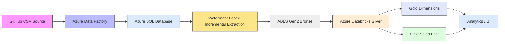
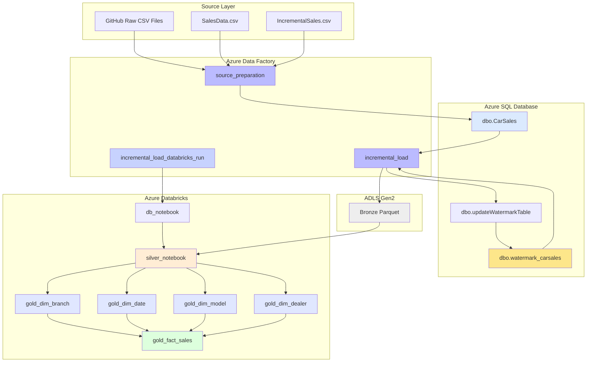
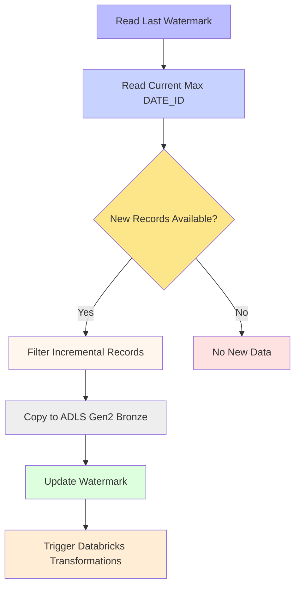
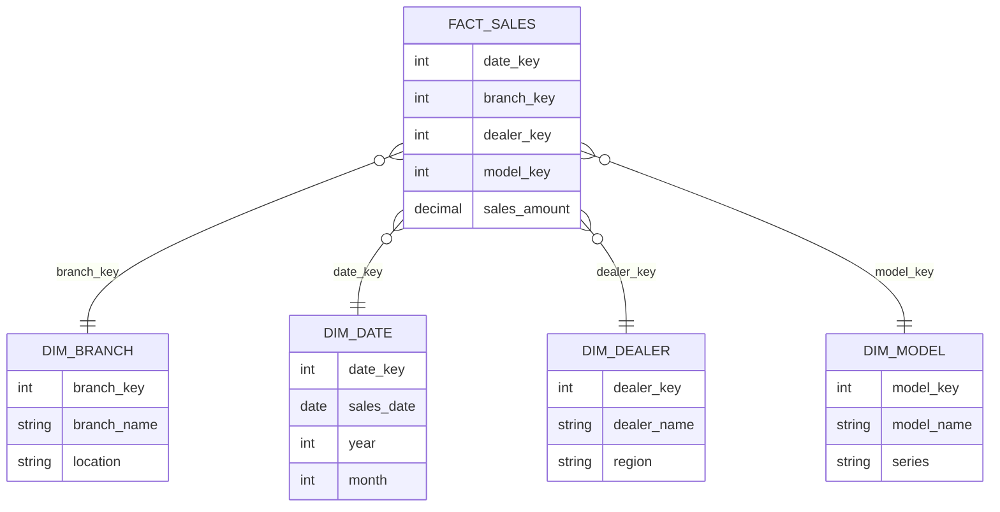

# BMW Cars Data Engineering 🚗

An end-to-end Azure Data Engineering project for BMW car sales data using **Azure Data Factory**, **Azure SQL Database**, **Azure Data Lake Storage Gen2**, and **Azure Databricks**.

The project demonstrates a practical **incremental data pipeline**, watermark-based processing, Medallion Architecture, dimensional modeling, and ADF-to-Databricks orchestration.

---

## Architecture

### High-Level Azure Architecture



### Detailed Component Architecture



### Incremental Load Flow



### Gold Data Model



---

## Project Overview

This repository contains ADF factory artifacts and Azure Databricks notebooks that implement a complete BMW car sales data pipeline.

### What the project demonstrates

- Source ingestion from GitHub-hosted CSV files.
- Azure SQL Database landing and control metadata.
- Watermark-based incremental extraction.
- ADLS Gen2 Bronze storage in Parquet.
- Azure Databricks Silver transformations.
- Gold dimensional modeling.
- Parallel dimension processing.
- Fact table generation after dimension completion.
- ADF orchestration across Azure services.

---

## Technology Stack

| Layer | Technology |
|---|---|
| Source | GitHub CSV |
| Orchestration | Azure Data Factory |
| Database | Azure SQL Database |
| Data Lake | Azure Data Lake Storage Gen2 |
| Processing | Azure Databricks |
| Language | Python / PySpark |
| Storage Format | Parquet |
| Architecture | Medallion Architecture |
| Modeling | Dimensional Modeling |

---

## Repository Structure

```text
bmw-cars-data-engineering/
├── data/
│   ├── SalesData.csv
│   └── IncrementalSales.csv
├── databricks/
│   ├── db_notebook.ipynb
│   ├── silver_notebook.ipynb
│   ├── gold_dim_branch.ipynb
│   ├── gold_dim_date.ipynb
│   ├── gold_dim_dealer.ipynb
│   ├── gold_dim_model.ipynb
│   └── gold_fact_sales.ipynb
├── dataset/
│   ├── ds_git.json
│   ├── sd_sqlDB.json
│   └── ds_bronze.json
├── linkedService/
│   ├── ls_git_data.json
│   ├── AzureSqlDatabase1.json
│   ├── AzureDataLakeStorage1.json
│   └── AzureDatabrickslink.json
├── pipeline/
│   ├── source_preparation.json
│   ├── incremental_load.json
│   └── incremental_load_databricks_run.json
├── factory/
│   └── adf-cars-swap-project.json
├── publish_config.json
└── readme.md
```

---

## Pipeline Flow

### Source Preparation

The `source_preparation` pipeline reads the GitHub CSV source and loads records into `dbo.CarSales` in Azure SQL Database.

### Incremental Extraction

The `incremental_load` pipeline reads the previous watermark, calculates the current maximum `DATE_ID`, extracts the incremental range, writes Bronze Parquet files to ADLS Gen2, and updates the watermark.

### Databricks Transformation

The `incremental_load_databricks_run` pipeline runs the Databricks transformation workflow after incremental extraction. Silver processing is followed by Branch, Date, Model, and Dealer dimensions, then the Sales Fact.

---

## Incremental Processing Strategy

The current implementation uses `DATE_ID` as the watermark-driven incremental field.

```text
Previous DATE_ID → Current MAX(DATE_ID) → Incremental Filter → Bronze → Watermark Update
```

This pattern reduces unnecessary full extraction and provides a clear control point for scheduled processing.

---

## Data Model

The Gold layer is organized around a central sales fact and reusable dimensions:

- **Fact:** Sales
- **Dimensions:** Branch, Date, Dealer, Model

Independent dimension notebooks can execute in parallel before the fact notebook runs.

---

## Configuration

Before deployment, configure the environment-specific values in the ADF JSON artifacts.

### Azure SQL

Update `linkedService/AzureSqlDatabase1.json` with your server, database, authentication, and secret configuration.

### ADLS Gen2

Update `linkedService/AzureDataLakeStorage1.json` with your storage endpoint and authentication settings.

### Azure Databricks

Update `linkedService/AzureDatabrickslink.json` with your workspace, cluster, and authentication configuration.

### Datasets and Notebook Paths

Validate the GitHub raw file URL, SQL table, Bronze Parquet path, and Databricks notebook paths for your environment.

> Do not commit passwords, tokens, connection strings, or access keys. Use managed identities or Azure Key Vault for production deployments.

---

## Prerequisites

- Azure subscription
- Azure Data Factory
- Azure SQL Database
- Azure Data Lake Storage Gen2
- Azure Databricks workspace and cluster
- Permissions to import or publish ADF artifacts
- SQL objects:
  - `dbo.CarSales`
  - `dbo.watermark_carsales`
  - `dbo.updateWatermarkTable`

---

## How to Run

1. Clone the repository.

```bash
git clone https://github.com/swapniltake1/bmw-cars-data-engineering.git
cd bmw-cars-data-engineering
```

2. Import the ADF factory artifacts.
3. Configure Azure SQL, ADLS Gen2, and Azure Databricks linked services.
4. Validate datasets, paths, and SQL control objects.
5. Run `source_preparation` to load source data into SQL.
6. Run `incremental_load` for Bronze-only incremental processing.
7. Run `incremental_load_databricks_run` for the complete Bronze to Silver to Gold workflow.

---

## Key Engineering Concepts

### Medallion Architecture

**Bronze** stores raw extracted data, **Silver** provides curated data, and **Gold** exposes analytics-ready dimensions and facts.

### Incremental Loading

Watermark processing extracts only the required incremental range instead of reprocessing the full source dataset.

### Orchestration

Azure Data Factory coordinates ingestion, control-table updates, and Databricks notebook execution.

### Dimensional Modeling

The Gold layer separates descriptive dimensions from the central sales fact for analytics use cases.

### Parallel Processing

Independent Gold dimensions can be processed concurrently before the final Sales Fact transformation.

---

## Production Considerations

For a production implementation, consider:

- Managed identities and Azure Key Vault for secrets.
- Parameterized ADF pipelines for multiple environments.
- Centralized monitoring and alerting.
- Data quality and schema validation.
- Retry and failure handling.
- CI/CD for ADF and Databricks artifacts.
- Partitioning and performance optimization for larger datasets.
- Handling late-arriving data and watermark edge cases.

---

## Future Enhancements

- Metadata-driven ingestion.
- Automated data quality checks.
- More robust late-arriving data handling.
- Unity Catalog integration.
- Automated CI/CD.
- Power BI reporting layer.
- Data lineage and observability.
- Automated PySpark testing.

---

## Author

**Swapnil Take**

Azure Data Engineer | Azure Data Factory | Azure Databricks | PySpark | SQL | ADLS Gen2

---

## License

This repository is provided as a data engineering demonstration project. Add a LICENSE file if you plan to distribute or reuse the project publicly.
